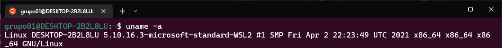
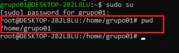
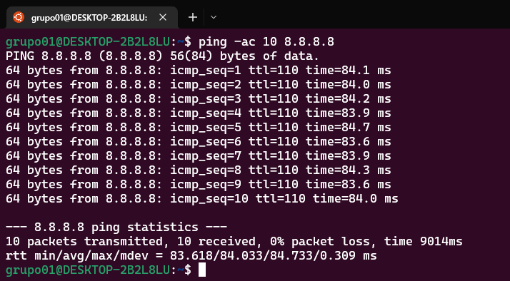
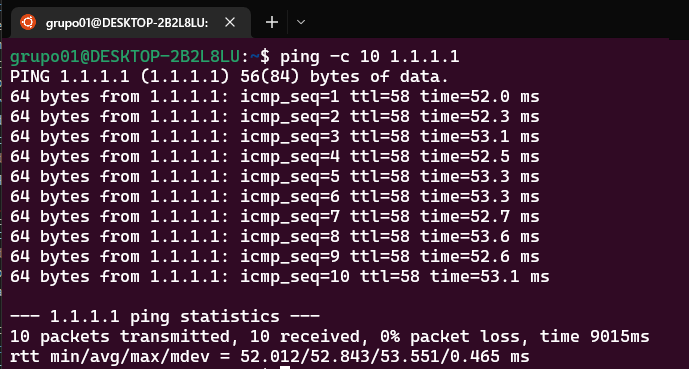
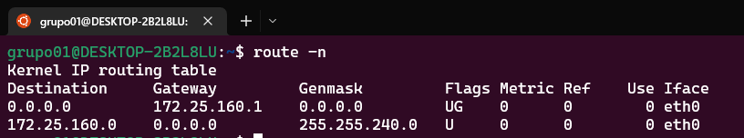
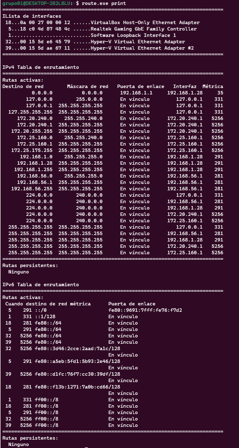
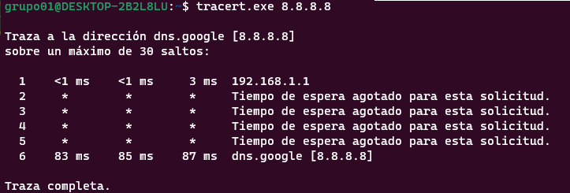

# <text style = "display:block; text-align: center"> <b>Reconocimiento Del Sistema</b>

| # | Comandos | <text style = "display:block; text-align: center"> Descripcion | <text style = "display:block; text-align: center">Imagen
|-- |--:|--:|--:| 
| 1 | <cite style="display:block; text-align: center"> uname -a | <cite style="display:block; text-align: justify">El comando (sudo su) permite a los Se mostrará el nombre del kernel o núcleo del sistema operativo. Pero este comando dispone del siguiente conjunto de opciones, que permiten obtener más información del sistema Linux donde se ejecute: <b>«a minúscula» / –all </b>, Si se añade al comando <b>uname</b> cualquiera de estas dos opciones, se mostrará toda la información técnca del sistema, que puede mostrar el comando uname: <b>uname -a;  uname --all</b></cite>|  | 
| 2 | <cite style="display:block; text-align: center"> cat /proc/sys/kernel/hostname | <cite style="display:block; text-align: justify">Con el comando <b>“cat”</b> podemos visualizar la información contenido en ficheros. Por lo que lo utilizaremos para ver el contenido del fichero <b>“/proc/sys/kernel/hostname»</b>.</cite>| |
| 3 | <cite style="display:block; text-align: center"> echo "$USER" | <cite style="display:block; text-align: justify"><b>echo</b> también puede mostrar variables. <b>$USER</b> es una variable de shell que contiene su nombre de usuario.</cite>| |
| 4 | <cite style="display:block; text-align: center"> pwd | <cite style="display:block; text-align: justify">El comando ls es una utilidad de El comando pwd significa “directorio de trabajo de impresión” y es un comando de Linux simple pero útil. Este comando se usa para mostrar el nombre de su directorio actual, lo que puede ser útil al navegar por el sistema de archivos.</cite>| |
| s | <cite style="display:block; text-align: center"> ifconfig wifi0 | <cite style="display:block; text-align: justify"></cite>| |
| 6 | <cite style="display:block; text-align: center"> ip route - grep default | <cite style="display:block; text-align: justify"> <b>ip route</b> nos permite ver y configurar la tabla de enrutamiento del sistema operativo, pero también nos permitirá ver y configurar todas las tablas de enrutamiento que nosotros creemos en el propio sistema operativo. Debemos tener en cuenta, que por cada entrada en la tabla de enrutamiento, debemos tener la dirección de red, máscara y el gateway, además, también podríamos configurar el ToS (tipo de servicio).</cite>| |
| 7 | <cite style="display:block; text-align: center"> curl ifconfig.me | <cite style="display:block; text-align: justify"><b>ifconfig.me</b> Es un servicio web que muestra información sobre tu conexión, incluida la dirección IP, el nombre de host y la cadena de agente de usuario.</cite>| |
| 8 | <cite style="display:block; text-align: center"> ping -ac 10 8.8.8.8 | <cite style="display:block; text-align: justify"> Utiliza el comando <b>ping</b> con la opción <b>-a</b> y la dirección IP del ordenador de destino para averiguar el nombre de host del destino. Se muestra el nombre del ordenador junto con la estadística Ping en el terminal. Con la bandera <b>-c</b> (recuento), puede especificar el número de pings que desea realizar.</cite>| |
| 9 | <cite style="display:block; text-align: center"> ping -c 10 1.1.1.1 | <cite style="display:block; text-align: justify"> Con la bandera <b>-c</b> (recuento), puede especificar el número de pings que desea realizar.</cite>| |
| 10 | <cite style="display:block; text-align: center"> route -n | <cite style="display:block; text-align: justify"> Mostrar la tabla de enrutamiento en forma numérica completa.</cite>| |
| 11 | <cite style="display:block; text-align: center"> route.exe print | <cite style="display:block; text-align: justify">muestra la configuración de enrutamiento de la red en el host.</cite>| |
| 12 | <cite style="display:block; text-align: center"> tracert.exe 8.8.8.8 | <cite style="display:block; text-align: justify">Ofrece una solución simple para seguir de cerca la pista a determinados paquetes de datos. Con base en estos resultados, el usuario puede diagnosticar qué estaciones individuales han enviado paquetes con un destino previsto, y dónde han surgido dificultades. Así, es posible identificar desvíos complicados o fallos en el router para comenzar con la solución de problemas.</cite>| |

# Mas Información
* [CÓMO SABER LA DIRECCIÓN IP PÚBLICA EN LINUX][1_0]
* [¿Qué es PING y cómo usarlo?][1_1]
* [Cómo utilizar el comando Ping en Windows][1_2]
* [COMANDO ROUTE EN LINUX CON EJEMPLOS][1_3]
* [¿Qué es Traceroute (tracert)?][1_4]

[1_0]:https://esgeeks.com/direccion-ip-publica-en-linux/#:~:text=curl%20-s%20http%3A%2Fifconfig,dirección%20IP%20pública%20mediante%20curl.&text=ifconfig.me%20es%20un%20servicio,cadena%20de%20agente%20de%20usuario.

[1_1]:https://geekflare.com/es/what-is-ping-and-command-examples/

[1_2]:https://www.ionos.es/digitalguide/servidores/herramientas/comando-ping/

[1_3]:https://es.acervolima.com/comando-route-en-linux-con-ejemplos/#:~:text=El%20comando%20route%20en%20Linux,de%20enrutamiento%20de%20IP%20%2F%20kernel.

[1_4]:https://www.ionos.es/digitalguide/servidores/herramientas/usa-traceroute-y-sigue-la-pista-de-tus-paquetes-de-datos/