<h1>

</h1>

# <text style = "display:block; text-align: center"> <b>NMAP</b>

<text style = "display:block; text-align: justify"> 

Nmap es un programa de código abierto que sirve para efectuar rastreo de puertos escrito originalmente por Gordon Lyon (más conocido por su alias Fyodor Vaskovich​) y cuyo desarrollo se encuentra hoy a cargo de una comunidad. Fue creado originalmente para Linux aunque actualmente es multiplataforma. Se usa para evaluar la seguridad de sistemas informáticos, así como para descubrir servicios o servidores en una red informática, para ello Nmap envía unos paquetes definidos a otros equipos y analiza sus respuestas.

Este software posee varias funciones para sondear redes de computadores, incluyendo detección de equipos, servicios y sistemas operativos. Estas funciones son extensibles mediante el uso de scripts para proveer servicios de detección avanzados, detección de vulnerabilidades y otras aplicaciones. Además, durante un escaneo, es capaz de adaptarse a las condiciones de la red incluyendo latencia y congestión de la misma.

# Instalacion NMAP

<text style = "display:block; text-align: justify"> 

Nos dirigimos al siguiente enlace: https://nmap.org/download.html#windows

Seleccionamos donde indica la siguiente imagen para descargar la versión estable más reciente:

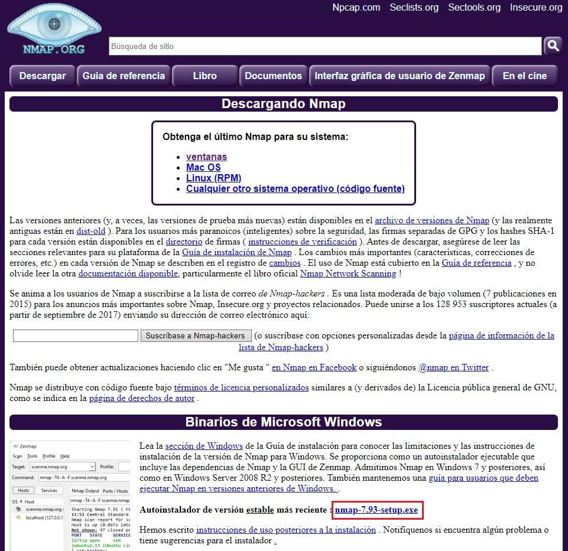

Una ves descargado procedemos con la instalación:

1- Ejecutamos el archivo descargado

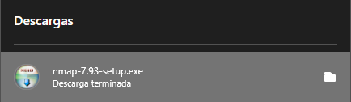

2- Aceptamos los terminos de licencia

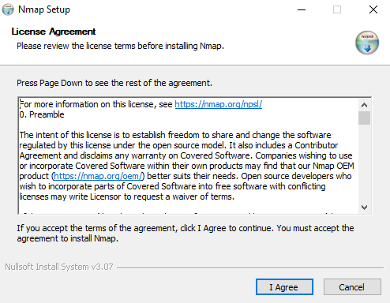

3- Le damos a Next

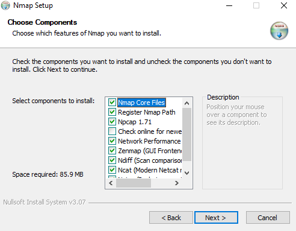

4- Seleccionamos la ruta de instalación y continuamos dando click en "Install"

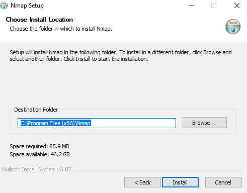

5- Nos aparecera la siguiente imagen, donde empezara la instalación

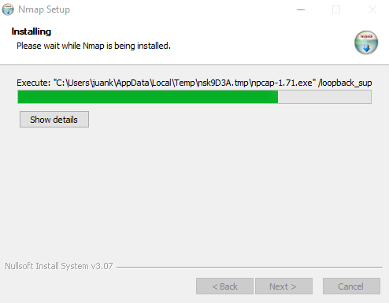

6- Despues de un corto tiempo nos aparece este recuadro de terminos de Licencia, al cual le daremos en "I Agree"

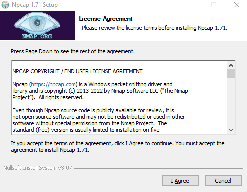

7- Proseguimos con dar click en "Install"

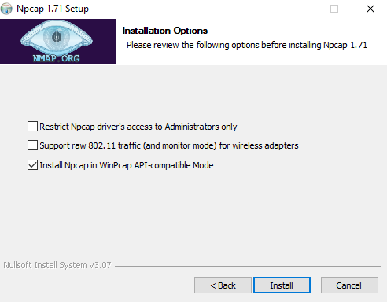

8- Esperamos que termine de instalar

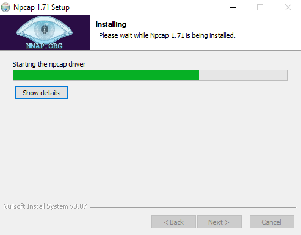

9- Cuando nos muestre que a completado le daremos en "Next"

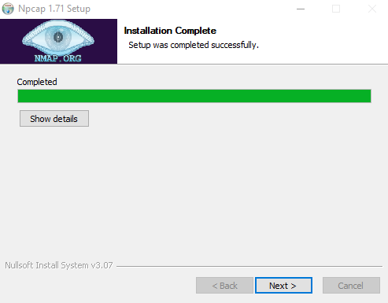

10- Luego le daremos en "Finish"

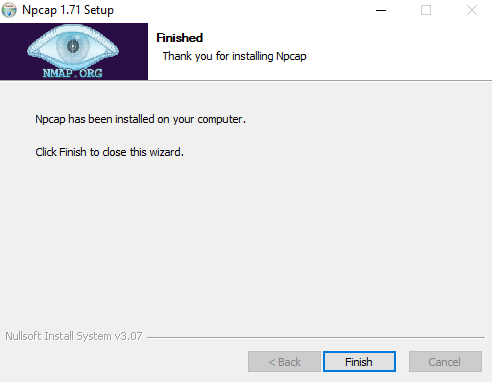

11- Continuamos dandole en "Next"

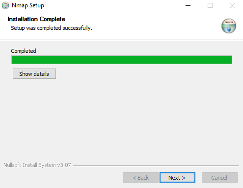

12- Le damos click en "Next"

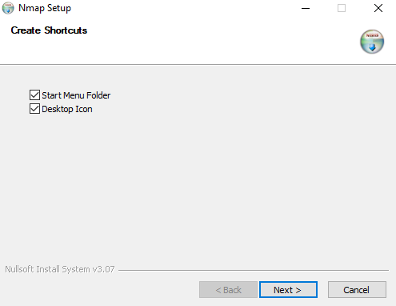

13- Finalizamos dando Click "Finish"

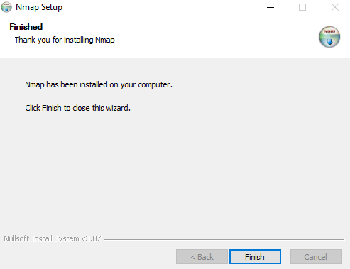

14- Ya tendriamos instalado NMAP

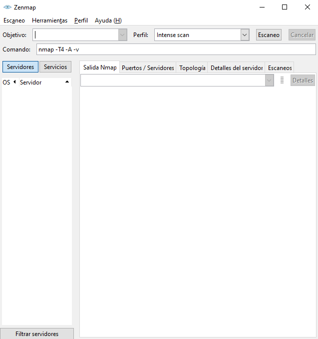

# Comprobacion de la carpeta de instalacion NMAP en el PATH
Ahora comprobamos que tengamos agragada la carpeta de instalacion de NMAP en el PATH del sistema de Windows

- Presionaremos nuestra tecla de Windows de nuestro teclado y escribiremos "variable, lo cual nos mostrara un aplicativo llamado "Editar las variables de entorno del sistema" la cual daremos Click

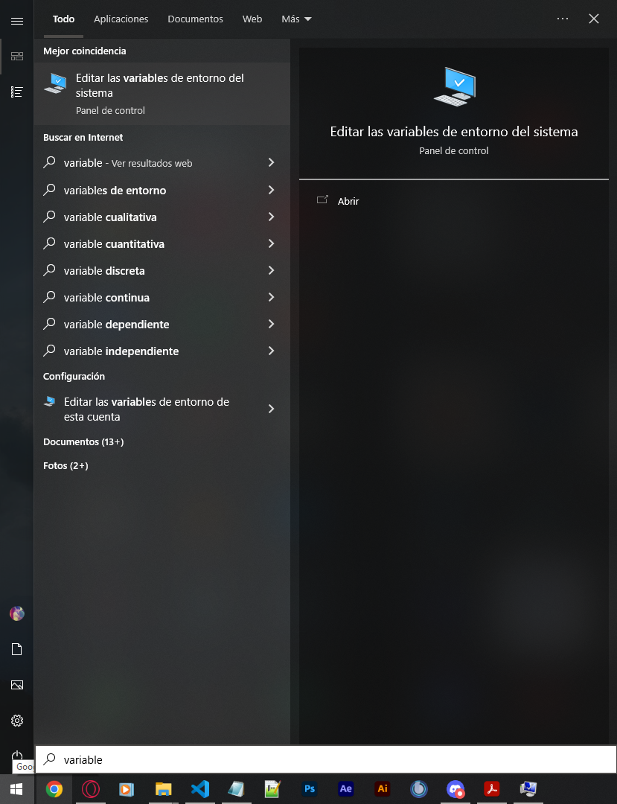

- Nos aparecera este recuadro y seleccionaremos donde dice "Variables de entorno.."

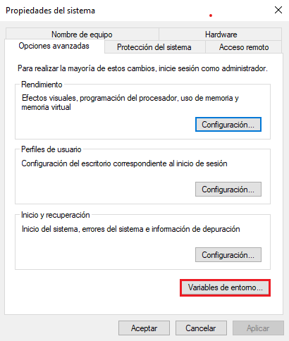

- Seleccionamos donde dice "Path" y luego en "Editar"

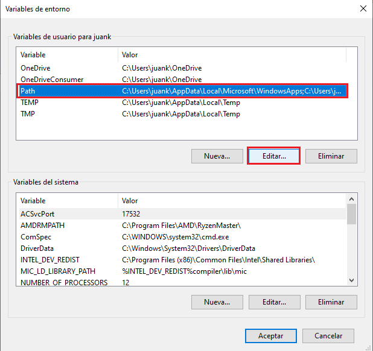

- Como podemos ver ya tenemos agregada la ruta de instalacion de NMAP en PATH

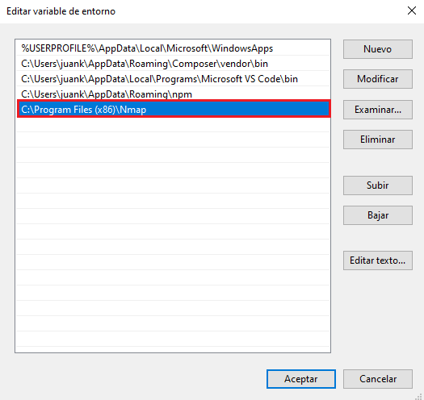

_________________________________________________________________________________
# **Comandos**

| # | **Comandos** |**Descripcion**| **Imangen**
|-- |:--:|:--:|:--:|
| 18 |**nmap localhost**| Estos son los puertos abiertos para la dirección **“localhost”**, que no es otra dirección más que la propia de la máquina servidor. Estos puertos evidentemente son locales, lo que quiere decir que no todos ellos necesiten ser abiertos en un router para poder dar los servicios hacia Internet, aunque muchos de ellos si.|
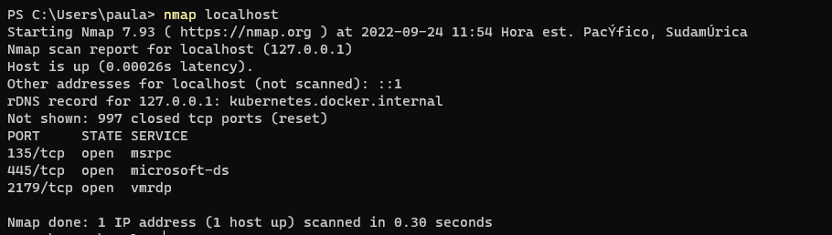

| 19 |**nmap 172.25.160.1**| Este es el formato básico para Nmap y devolverá información sobre los puertos en ese sistema.|
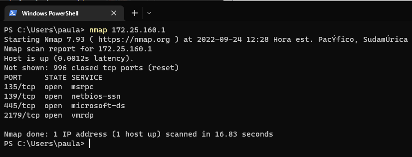

| 20 |**nmap -sP -n xxx.xxx.xxx.0/24**| |

| 21 |**nmap -sP -n xxx.xxx.xxx.100-110**| |

| 22 |**nmap -iL lista_ip.txt**|Se pasan los objetivos en un fichero, cada uno en una línea|
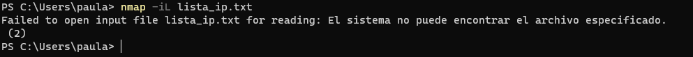

| 23 |**nmap scanme.nmap.org**|Esta opción escanea todos los puertos TCP reservados en la máquina scanme.nmap.org.|
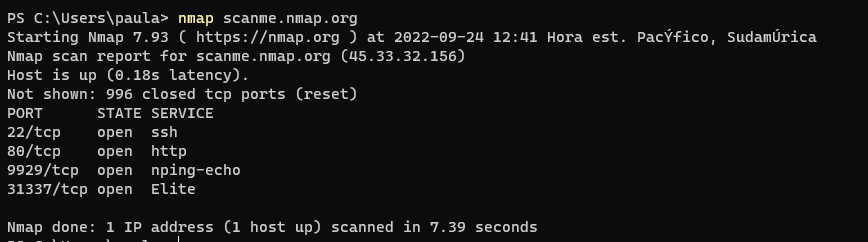

| 24 |**nmap 1.1.1.1 8.8.8.8**|Esta opción escanea dos direcciones IP a la misma vez. |
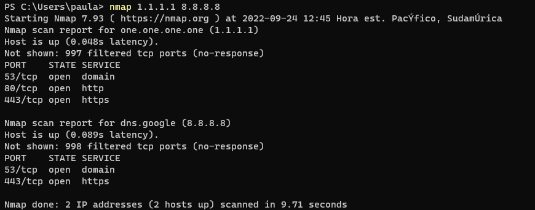

| 25 |**nmap udenar.edu.co**||
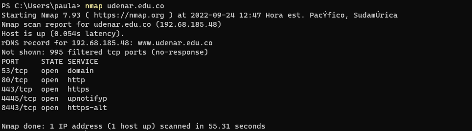

# Mas Información
* [NMAP][1_0]
* [Nmap una aplicación fundamental en tu sistema linux][1_1]

[1_0]: https://es.wikipedia.org/wiki/Nmap

[1_1]: https://www.profesionalreview.com/2016/01/27/nmap-una-aplicacion-fundamental/

