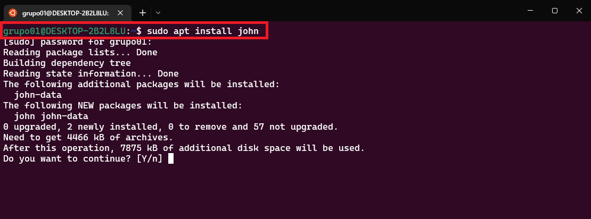
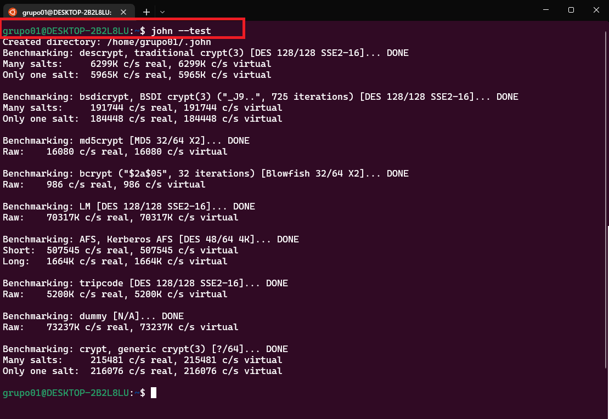
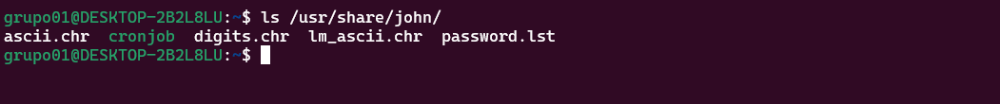
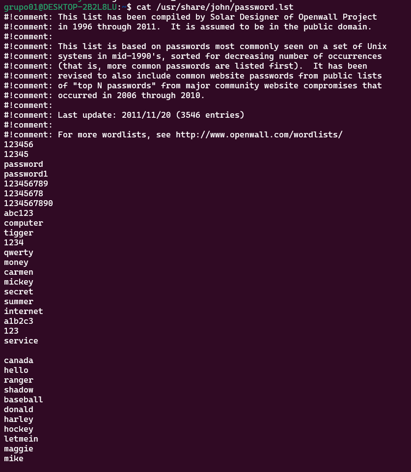
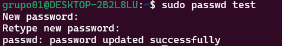
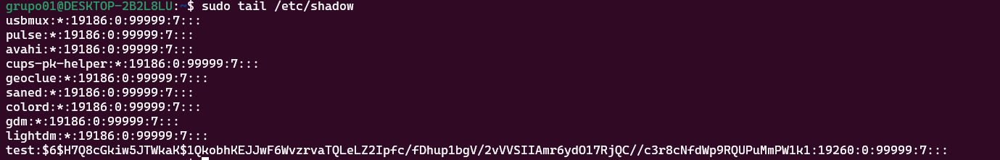
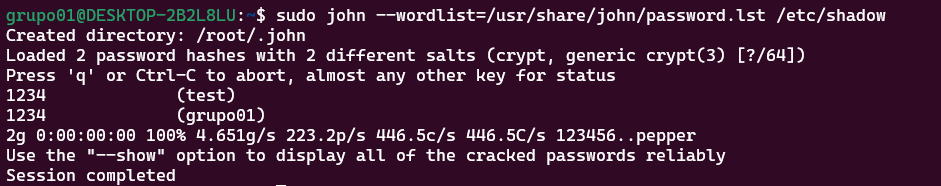
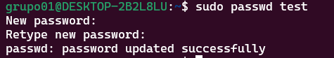
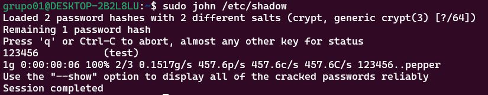

# <text style = "display:block; text-align: center"> **John the Ripper**

<h1>

</h1>

<text style = "display:block; text-align: justify"> **John the Ripper es una herramienta de crackeo de contraseñas** escrita en C y muy utilizada por los analistas de seguridad para comprobar la robustez de una clave frente a ataques de fuerza bruta. Este programa es capaz de romper los hashes MD5, SHA-1 y otros muchos ampliamente utilizados en el mundo informático. Este programa es capaz de detectar de forma automática el tipo de hash que estamos crackeando, con el objetivo de facilitar al usuario su crackeo sin necesidad de preocuparse por el tipo de hash que está intentando «romper».

Algunas características muy importantes de este programa es que está optimizado para muchos modelos de procesadores, funciona en muchas arquitecturas de PC y también en diferentes sistemas operativos, no obstante, generalmente se utiliza en sistemas operativos basados en Linux, de hecho, las principales distribuciones Linux orientadas al pentesting y a la seguridad informática ya incorporan de forma predeterminada este programa.

Este programa es muy personalizable, nos permite definir la longitud a probar de una contraseña, para generar todas las combinaciones posibles y lograr el objetivo de crackear el hash. También nos permite configurar qué rango de letras, números o símbolos podemos probar para descifrar la contraseña, además, también permite incluir reglas para decidir cómo deben hacerse las diferentes variaciones.

John the Ripper permite pausar el crackeo de la contraseña y continuarlo en otro momento, esto es algo ideal por si tenemos que apagar nuestro PC o servidor, además, se puede automatizar para empezar a crackear una determinada contraseña al arrancar nuestro ordenador, y todo ello de forma automática sin necesidad de intervención del administrador de sistemas.

Algunos de sus usos, es en el ámbito de administración, este se usa para evitar que los usuarios establezcan contraseñas con bajos niveles de seguridad, o fáciles. Para esto, con la versión gratuita tendremos de sobra, pues nos indicará si las contraseñas son lo suficientemente seguras, sin necesidad de que ningún administrador sepa cual es la propia contraseña.

# **¿Qué versiones existen?**

<text style = "display:block; text-align: justify"> Actualmente, nos podemos encontrar tres versiones de este software. En primer lugar tenemos la versión gratuita, que es la más utilizada, luego tenemos John the Ripper Pro, y la versión John The Ripper Jumbo. Cabe destacar, que se trata de software libre, distribuido bajo licencia GPL, que si bien permite que algunas partes se usen con otras licencias, otras están bajo el dominio público. En un principio fue creado para funcionar en sistemas Unix, pero actualmente podemos usarlo en unos 15 sistemas operativos diferentes. Entre ellos, once tipos de Unix, MS-DOS, Windows, BeOS y OpenVMS. Pero lo más habitual es encontrarlo en las distribuciones de Linux.

Si hablamos de la versión Pro, obviamente tendremos algunas ventajas frente a la gratuita. Por ejemplo, en esta versión de pago nos detectará de forma automática cualquier mejora en la tecnología que soporte el procesador de la máquina en la que se instaló. También tendremos un diccionario con más de 4 millones de entradas, donde detectará las mejoras de forma automática. De este modo nos ahorrará tiempo al evitarnos tener que realizar actualizaciones.

John the Ripper Jumbo, se trata de un parche que permite trabajar con una mayor cantidad de algoritmos. Como se trata de la versión que está en desarrollo, muchas de sus funciones no están a su máximo rendimiento, por lo cual puede llegar a presentar algún inconveniente.

# **¿Qué es el crackeo?**

<text style = "display:block; text-align: justify"> Antes de definir lo que es el crackeo, cabe recordar lo qué es el hackeo. En lo que a ordenadores se refiere, el hackeo es utilizar diferentes herramientas o tecnología para superar obstáculos. Cuando un hacker logra acceder a un sistema, se le conoce como hackeo de seguridad.

En el caso del crackeo, va un poco más lejos. Esto sucede cuando se lleva a cabo un hackeo de seguridad con una finalidad maliciosa, por alguien denominado cracker. Podemos poner de ejemplo a los ladrones, que abren una caja fuerte, mediante una manipulación de la cerradura. En este caso es lo mismo, pero digitalmente.

Esto puede llevarlo a cabo con multitud de fines, como por ejemplo:

* **Robo de datos:** Si un cracker consigue acceder a un servidor de una corporación, puede conseguir gran cantidad de datos que pueden ser muy valiosos.
Es posible que estos no los necesite más que para pedir un rescate por los mismos.

* **Espionaje:** Igual que en el ejemplo anterior, se puede usar para espiar. De esta forma podrán conocer planes y demás secretos comerciales. Se han dado casos de crackeos patrocinados por empresas e incluso por países.

* **Manipulación de datos:** En este caso no tratarán de robar la información, si no de cambiarla modificando los datos almacenados en un servidor. Como por ejemplo balances bancarios, falsificar registros, entre otras.

* **Daños:** Esto puede ocurrir cuando un crackeo se realiza con la intención de eliminar los datos. Esto pueden ser daños de valores incalculables para muchas empresas.

* **Propagar malware:** Una vez se encuentran dentro del sistema, los crackers pueden realizar una infección mediante malware. Esto puede abarcar desde spyware que registra actividades de usuarios, adwares que inundan a los usuarios de ventanas emergentes, ransomware que cifra los datos del servidor, hasta rootkits, que se pueden encargar de ocultar el resto de malware.

# **Ataques por diccionario**

<text style = "display:block; text-align: justify"> Este programa nos permite crackear contraseñas por diccionario, si nos descargamos uno o varios diccionarios de contraseñas de Internet de varias decenas de GB, la herramienta se encargará de probar todas y cada una de estas claves para intentar crackear el hash de la contraseña. El proceso consiste en generar el hash de cada contraseña, para posteriormente comparar el hash que queremos romper, si el hash es el mismo entonces hemos descubierto la contraseña, si el hash no coincide entonces no es la clave y tendremos que seguir probando. Podremos crackear las contraseñas que estén contenidas en los diccionarios de claves de forma completamente automatizada.

Un aspecto destacable es que no solamente prueba las claves de los diccionarios, sino que también añade números, mayúsculas, minúsculas y símbolos a las palabras que le ponemos como «entrada», además, también es capaz de combinar palabras para probar aún más combinaciones de contraseñas y dar con la clave utilizada.

# **Ataque de fuerza bruta**

<text style = "display:block; text-align: justify"> El ataque por fuerza bruta consiste en probar todas las combinaciones de letras, números y símbolos de una clave con una determinada longitud. Este método es el más lento porque probará todas las combinaciones, y puede tardar horas, días e incluso años en crackear contraseñas con una cierta longitud. Por lo general, crackear una contraseña de más de 12 caracteres nos llevará muchísimo tiempo haciéndolo por fuerza bruta, por tanto, debes tenerlo muy en cuenta.

Este programa nos permite configurar este ataque de fuerza bruta, le indicaremos que pruebe solo letras, letras y números, e incluso añadir símbolos. Cuantos más caracteres de «entrada» tengamos, más tardará en probar todas las combinaciones de contraseñas posibles, por lo que deberemos tenerlo muy en cuenta a la hora de configurar la entrada.

Una vez que ya conocemos qué es John the Ripper y sus dos modos de funcionamiento, vamos a ver cómo puede utilizar un administrador de sistemas este programa para comprobar la seguridad de la clave del equipo. De esta forma, comprobaremos si somos vulnerables a un ataque de fuerza bruta o diccionario por parte de un pirata informático que busca obtener acceso remoto (o local) al mismo.

# **Instalación**

<text style = "display:block; text-align: justify"> Para instalar **John the Ripper** utilizaremos el siguiente comando

                                    sudo apt install john

<h1>

</h1>

<text style = "display:block; text-align: justify">Una vez instalada la herramienta en nuestro sistema operativo, ya podremos utilizarla y empezar a crackear contraseñas, no obstante, sería muy recomendable antes de empezar a crackear claves, realizar una prueba rápida de velocidad de nuestro ordenador.

# **Probar el rendimiento en nuestro PC**

<text style = "display:block; text-align: justify">Antes de empezar con el crackeo de las contraseñas podemos lanzar un sencillo test de rendimiento donde se pondrá a prueba nuestro hardware. De esta manera, podremos saber la velocidad con la que la herramienta probará claves con diferentes tipos de cifrado utilizando el 100% de nuestra CPU.

Utilizaremos el siguiente comando

                                            john --test

<h1>

</h1>

Como podemos ver, se llevan a cabo una serie de tests donde se medirá el rendimiento, esto nos puede dar una idea en general de la potencia de procesamiento de nuestro ordenador, con el objetivo de probar todas las combinaciones de letras, números y símbolos en el menor tiempo posible.

Con esto ya estaremos listos para probar los comandos necesarios y realizar pruebas.

| # | **Comandos** |**Descripcion**| **Imangen**
|-- |--:|--:|--:|
| 26 |**sudo apt install john** |Instalar **John the Ripper** por consola|

| 27 |**ls /usr/share/john/**|Nos muestra lo que tenemos en la carpeta John|

| 28 |**cat /usr/share/john/password.lst**|Muestra el contenido del archivo password.lst|

| 29 |**sudo useradd -m test**|Añade el usuario X con una clave|

| 30 |**sudo passwd test**|Hacemos un test del nuevo password|

| 31 |**sudo tail /etc/shadow**|NN (No sabo No Respondo ☺♥)|

| 32 |**sudo john --wordlist=/usr/share/john/password.lst /etc/shadow**|Realiza la prueba de desifrar la contraseña y nos indica el tiempo que demora en desifrarla|

| 33 |**sudo passwd test**|Hacemos un test del nuevo password|

| 34 |**sudo john /etc/shadow**|Realiza la pruba de desifrar la contraseña|

# Mas Información
* [Crackea contraseñas rápidamente usando John the Ripper][1_0]

[1_0]: https://www.redeszone.net/tutoriales/seguridad/crackear-contrasenas-john-the-ripper/

